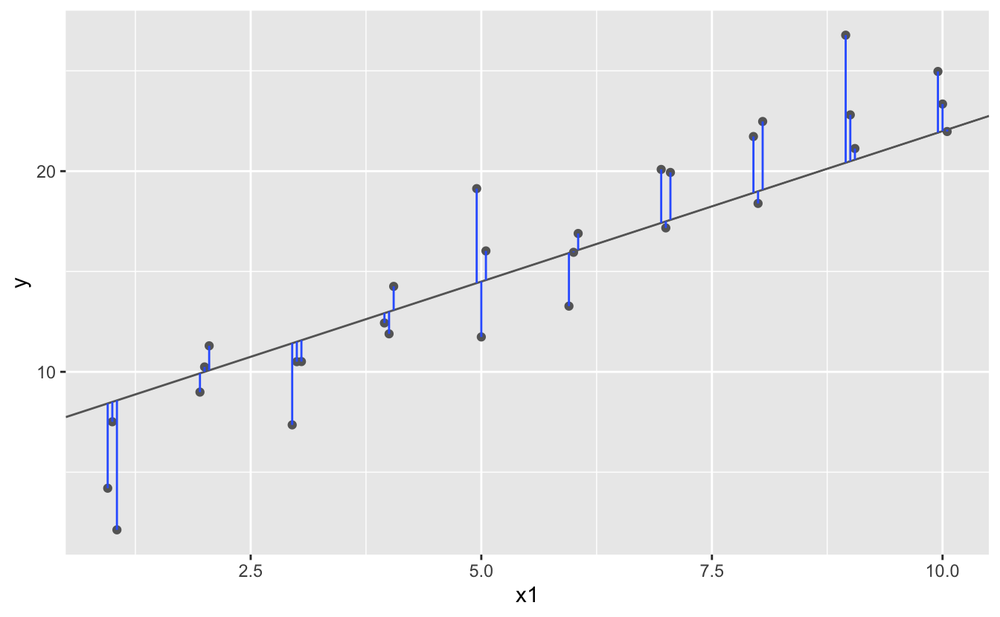

# Review de modelos en R {-}

Los miembros del Cohorte 01 decidieron incluir una sesión para revisar la construcción de modelos en `R`.

El objetivo de un modelo es dar un resumen de baja dimensión de un dataset. Idealmente, el modelo capturará *señales* verdaderas, es decir, patrones generados por el 
fenómeno que nos interesa y va a ignorar el *ruido*, es decir, variación aleatoria en la que no estamos intereados. 

Tradicionalmente los modelos se enfocan en inferencia, o para confirmar que una hipótesis es verdadera. Hacer esto de forma correcta no es complicado pero es difícil. Primero tenemos que entender dos ideas:

1. Cada observación puede ser usada para exploración o para confirmación, pero no para ambas. 
2. Podemos usar una observación tantas veces como queramos para exploración, pero solamente una vez para confirmación. Si la usamos dos veces, nos hemos pasado de confirmación a exploración. 

Hay dos partes importantes de un modelo:

1. Definimos una **familia** de modelos que expresen un patrón preciso, pero genérico, el cual queremos calcular. Por ejemplo, para una línea recta, utilizaríamos la ecuación 
`y = a_1 * x + a_2` o para una curva cuatrádica, la familia `y = a_1 * x ^ a_2`. `x` y `x` son variables que conocemos gracias a nuestros datos y `a_1` y `a_2` son parámetros que pueden variar para calcular diferentes patrones. 
2. Generamos un modelo ajustado, encontrando el modelo de la familia que mejor se acerca a nuestros datos. Esto toma el modelo genérico de la familia y lo hace específico, como `y = 3 * x + 7 or y = 9 * x ^ 2`.

El modelo ajustado es el mejor de la familia que poemos obtener, no significa que sea bueno. 


## Un modelo simple

```{r message = FALSE, warning = FALSE}
library(tidyverse)

library(modelr)
options(na.action = na.warn)
```

Se utiliza el dataset `sim1` del paquete `modelr`

```{r}
ggplot(sim1, aes(x, y)) + 
  geom_point()
```

Podemos usar un modelo lineal `y = a_0 + a_1 * x` para capturar el patrón que muestran los datos. 

```{r}
models <- tibble(
  a1 = runif(250, -20, 40),
  a2 = runif(250, -5, 5)
)

ggplot(sim1, aes(x, y)) + 
  geom_abline(aes(intercept = a1, slope = a2), data = models, alpha = 1/4) +
  geom_point() 
```

Pero, ¿cuál es la mejor línea? Si tomamos la distancia vertical entre cada punto y el modelo, que sería la diferencia entre el modelo (la **predicción**) y el valor real de `y` en los datos (la **respuesta**).


Por ejemplo:


```{r}
model1 <- function(a, data) {
  a[1] + data$x * a[2]
}
model1(c(7, 1.5), sim1)
```

Y para obtener un solo número, usamos **error cuadrático medio** RMSE, que también se conoce como raíz de la desviación cuadrática media.

```{r}
measure_distance <- function(mod, data) {
  diff <- data$y - model1(mod, data)
  sqrt(mean(diff ^ 2))
}
measure_distance(c(7, 1.5), sim1)
```

Y usamos `purrr` para obtener los RMSE de todas las líneas.

```{r}
sim1_dist <- function(a1, a2) {
  measure_distance(c(a1, a2), sim1)
}

models <- models %>% 
  mutate(dist = purrr::map2_dbl(a1, a2, sim1_dist))
models
```

Y vemos los 10 mejores

```{r}
ggplot(sim1, aes(x, y)) + 
  geom_point(size = 2, colour = "grey30") + 
  geom_abline(
    aes(intercept = a1, slope = a2, colour = -dist), 
    data = filter(models, rank(dist) <= 10)
  )
```

Una mejor forma de atacar el problema es la herramienta de minimización llamada búsqueda Newton-Raphson. La intuición es: se elige un punto y se busca la pendiente más empinada, se desliza por esa pendiente y se repite nuevamente. En `R` se puede hacer con `optim()`:


```{r}
best <- optim(c(0, 0), measure_distance, data = sim1)
best$par
#> [1] 4.222248 2.051204

ggplot(sim1, aes(x, y)) + 
  geom_point(size = 2, colour = "grey30") + 
  geom_abline(intercept = best$par[1], slope = best$par[2])
```

O también se puede hacer con `lm()`, donde especificamos la familia del modelo usando fórmulas. En particular, `y~x` se traduce a `y = a_1 + a_2 * x`, que no utliza `optim()` atrás. 

```{r}
sim1_mod <- lm(y ~ x, data = sim1)
coef(sim1_mod)
```


## Visualización de los modelos

Las **predicciones** ayudan a entender el patrón capturado por el modelo y los **residuos**, la distancia entre las predicciones y  los datos, nos dicen lo que el modelo no pudo capturar.

Primero se genera un grid con puntos igualmente espaciados que cubren la región de los datos. 

```{r}
grid <- sim1 %>% 
  data_grid(x) 
grid
```

Luego se agregan las predicciones

```{r}
grid <- grid %>% 
  add_predictions(sim1_mod) 
grid
```

Y las graficamos 

```{r}
ggplot(sim1, aes(x)) +
  geom_point(aes(y = y)) +
  geom_line(aes(y = pred), data = grid, colour = "red", size = 1)
```

Agregamos los residuos

```{r}
sim1 <- sim1 %>% 
  add_residuals(sim1_mod)
sim1
```


Podemos ver su distribución, la media siempre es 0. 

```{r}
ggplot(sim1, aes(resid)) + 
  geom_freqpoly(binwidth = 0.5)
```

Y también podemos graficarlos

```{r}
ggplot(sim1, aes(x, resid)) + 
  geom_ref_line(h = 0) +
  geom_point() 
```

Como parecen random noice, significa que nuestro modelo hizo buen trabajo capturando el patrón en los datos. 


## Fórmulas y familias de modelos

Podemos utilizar la función `model_matrix()`, para ver cómo define `R` la ecuación de un modelo. En la salida cada columna está asociada con un coeficiente en el modelo y la función es siempre ` y = a_1 * out1 + a_2 * out_2.`


```{r}
df <- tribble(
  ~y, ~x1, ~x2,
  4, 2, 5,
  5, 1, 6
)
model_matrix(df, y ~ x1)

model_matrix(df, y ~ x1 - 1) #Para quitar el intercepto

model_matrix(df, y ~ x1 + x2)
```
La notación para las fórmulas también se llama "Wilkinson-Rogers notation". 

Las **variables categóricas** no podemos añadirlas de la misma forma. Por ejemplo, si tenemos la variable `sex`, no tiene sentido hacer `y = x_0 + x_1 * sex`, porque no es un número y no puede multiplicarse. Lo que hace `R` es convertir la ecuación a `y = x_0 + x_1 * sex_male` donde `sex_male` es 1 si `sex` es masculino y 0, si no. 

```{r}
df <- tribble(
  ~ sex, ~ response,
  "male", 1,
  "female", 2,
  "male", 1
)
model_matrix(df, response ~ sex)
```

No genera la variable `sex_female` porque esta puede ser derivada de `sex_male`. 

### Interacciones

## Otras familias de modelos

Los modelos lineales asumen que los residuos tienen una distribución normal y que la respuesta es contínua, pero existen otros modelos. Por ejemplo:

- Modelos lineales generalizados `stats::glm()`. Los modelos lineales generlizados extienden a los modelos lineales para incluir respuestas no contínuas como datos binarios. Definen una métrica de distancia basados en la idea estadística de la similitud.

- Modelos aditivos generalizados `mgcv::gam()`, incorporan funciones *smooth* arbitrarias. Podemos escribir una fórmula como `y ~ s(x)`, que se convierte en una ecuación `y = f(x)` y `gam()` estima qué función es, con algunas restricciones de *smoothness* para que el problema sea más tratable.

- Modelos lineales penalizados `glmnet::glmnet()`, agregan un término de penalización a la distancia para modelos complejos (distance entre el vector del parámetro y el origen), para generar modelos que generalicen mejor a nuevos datasets de la misma población. 

- Modelos lineales robustos `MASS::rlm()`, transforman la distancia a puntos de peso reducido *downweight points* que están muy lejos. Con esto son menos sensibles a la presencia de outliers, pero no son muy buenos cuando no hay outliers. 

- Árboles `rpart::rpart()`, abordan el problema de forma completamente diferente que los modelos lineales. Ajustan un modelo *piece-wise*, como escalera, separando los datos en pedazos cada vez más pequeños. Son aún mejores cuando se usan de forma agregada como en  random forests `(e.g. randomForest::randomForest())` o en máquinas de gradiente impulsado,  *gradient boosting machines* `(e.g. xgboost::xgboost())`

